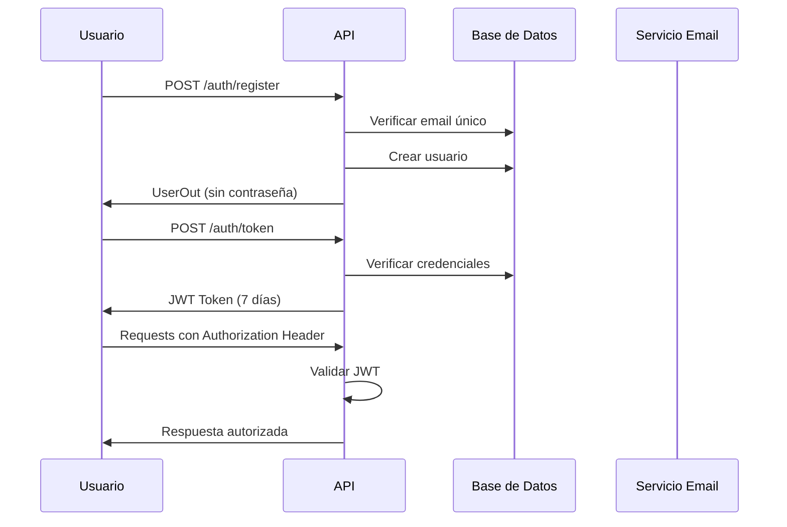
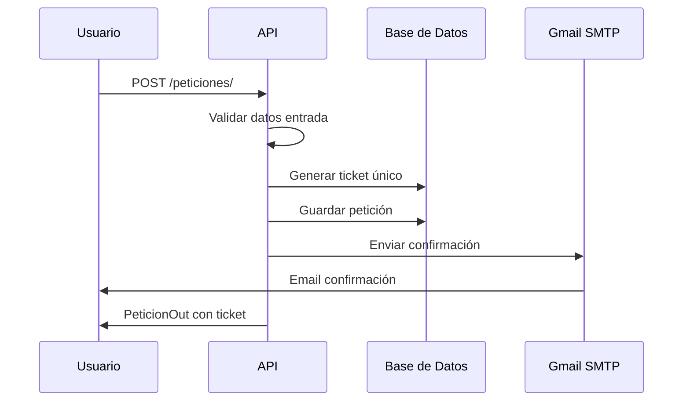

# Documentación de la API - Monte Sion Backend

## Resumen Ejecutivo

La API de Monte Sion es un sistema backend desarrollado para el proyecto final del Bootcamp Backend con Python en Código Facilito y se tiene la intención de en un futuro utilizar esta API de manera mas profesional para Iglesia Cristiana Monte Sion Oaxaca. Proporciona servicios de autenticación de usuarios y gestión de peticiones de oración con notificaciones de confirmación por correo electrónico.

## Arquitectura del Sistema

### Patrón de Arquitectura
- **Arquitectura en Capas**: Separación clara entre modelos, esquemas, routers y lógica de negocio
- **Patrón Repository**: Uso de SQLAlchemy para abstracción de datos
- **Dependency Injection**: FastAPI dependency system para gestión de dependencias

### Componentes Principales

1. **Capa de Presentación** (`routers/`)
   - Manejo de requests HTTP
   - Validación de entrada
   - Serialización de respuestas

2. **Capa de Lógica de Negocio**
   - Autenticación JWT
   - Generación de tickets
   - Envío de correos

3. **Capa de Datos** (`models/`)
   - Modelos SQLAlchemy
   - Conexión a PostgreSQL

4. **Capa de Validación** (`schemas/`)
   - Esquemas Pydantic
   - Validación de tipos

## Flujos de Trabajo

### Flujo de Autenticación


### Flujo de Peticiones de Oración


## Especificaciones Técnicas

### Base de Datos

**Motor**: PostgreSQL  
**ORM**: SQLAlchemy  
**Esquema**:

```sql
-- Tabla users
CREATE TABLE users (
    id SERIAL PRIMARY KEY,
    nombre VARCHAR NOT NULL,
    apellido VARCHAR NOT NULL,
    correo_electronico VARCHAR UNIQUE NOT NULL,
    hashed_password VARCHAR NOT NULL,
    telefono VARCHAR,
    descripcion TEXT,
    cumpleaños DATE,
    is_active BOOLEAN DEFAULT TRUE
);

-- Tabla peticiones
CREATE TABLE peticiones (
    id SERIAL PRIMARY KEY,
    ticket INTEGER UNIQUE NOT NULL,
    nombre VARCHAR NOT NULL,
    apellido VARCHAR,
    correo_electronico VARCHAR NOT NULL,
    telefono VARCHAR,
    asunto VARCHAR NOT NULL,
    peticion TEXT NOT NULL,
    fecha TIMESTAMP WITH TIME ZONE DEFAULT NOW()
);

-- Índices recomendados
CREATE INDEX idx_users_email ON users(correo_electronico);
CREATE INDEX idx_peticiones_ticket ON peticiones(ticket);
CREATE INDEX idx_peticiones_fecha ON peticiones(fecha);
```

### Autenticación JWT

**Algoritmo**: HS256  
**Expiración**: 7 días  
**Payload**:
```json
{
  "sub": "usuario@email.com",
  "exp": 1672531200
}
```

### Validaciones de Datos

**Usuario (Registro)**:
- Email: Formato válido + único en BD
- Contraseña: Mínimo requerido por bcrypt
- Nombre/Apellido: Requeridos

**Petición**:
- Nombre: Mínimo 2 caracteres
- Asunto: Mínimo 2 caracteres  
- Petición: Mínimo 10 caracteres
- Email: Formato válido

## Configuración de Seguridad

### Hashing de Contraseñas
- **Algoritmo**: bcrypt
- **Rounds**: Default de Passlib (actualmente 12)
- **Salt**: Generado automáticamente

### CORS Policy
```python
origins = [
    "https://montesion.me",
    "http://localhost:8000",
    "http://127.0.0.1:8000"
]
allow_credentials = True
allow_methods = ["*"]
allow_headers = ["*"]
```

### Variables de Entorno Sensibles
```env
# Producción - Render
DATABASE_URL=postgresql://...
JWT_SECRET=clave-super-secreta-256-bits
EMAIL_REMITENTE=iglesia@gmail.com
EMAIL_PASSWORD=app-password-16-chars
PORT=8000

# Opcional
NODE_ENV=production
RENDER=true
```

## Sistema de Correo Electrónico

### Configuración SMTP
- **Proveedor**: Gmail SMTP
- **Host**: smtp.gmail.com
- **Puerto**: 587 (TLS)
- **Autenticación**: App Password

### Plantillas de Email

**Confirmación de Petición**:
```
Asunto: Confirmación de petición de oración, {ticket}

Hola, {nombre} 👋.

Gracias por enviar tu petición de oración. Estaremos orando por ti.

Tu petición:
{mensaje_peticion}

---

Dios te bendiga ✨.
El equipo de soporte y oración Monte Sion 💖
```

**Recuperación de Contraseña**:
```
Asunto: Recuperación de contraseña - Monte Sion

Hola, {nombre} 👋

Has solicitado restablecer tu contraseña. Aquí tienes una nueva contraseña temporal:

Nueva contraseña: {nueva_contraseña}

Inicia sesión y cámbiala lo antes posible por seguridad.
```

## Endpoints de la API

### Documentación OpenAPI
Disponible en: `http://localhost:8000/docs`

### Autenticación - `/auth`

#### `POST /auth/register`
**Propósito**: Registrar nuevo usuario  
**Body**:
```json
{
  "nombre": "Juan",
  "apellido": "Pérez", 
  "correo_electronico": "juan@email.com",
  "password": "contraseña123"
}
```
**Respuesta 201**:
```json
{
  "id": 1,
  "nombre": "Juan",
  "apellido": "Pérez",
  "correo_electronico": "juan@email.com",
  "is_active": true
}
```

#### `POST /auth/token`
**Propósito**: Iniciar sesión OAuth2  
**Body** (form-data):
```
username=juan@email.com
password=contraseña123
```
**Respuesta 200**:
```json
{
  "access_token": "eyJhbGciOiJIUzI1NiIsInR5cCI6IkpXVCJ9...",
  "token_type": "bearer"
}
```

#### `PUT /auth/update`
**Propósito**: Actualizar perfil usuario  
**Headers**: `Authorization: Bearer {token}`  
**Body** (campos opcionales):
```json
{
  "nombre": "Juan Carlos",
  "telefono": "+52 951 123 4567",
  "descripcion": "Miembro activo de la iglesia",
  "cumpleaños": "1990-05-15"
}
```

#### `DELETE /auth/delete`
**Propósito**: Eliminar cuenta  
**Headers**: `Authorization: Bearer {token}`  
**Respuesta**: 204 No Content

### Peticiones - `/peticiones`

#### `POST /peticiones/`
**Propósito**: Crear petición de oración  
**Body**:
```json
{
  "nombre": "María González",
  "correo_electronico": "maria@email.com", 
  "asunto": "Oración por sanidad",
  "peticion": "Por favor oren por la salud de mi familia en estos momentos difíciles..."
}
```
**Respuesta 201**:
```json
{
  "id": 1,
  "ticket": 1001,
  "nombre": "María González",
  "correo_electronico": "maria@email.com",
  "asunto": "Oración por sanidad", 
  "peticion": "Por favor oren por la salud de mi familia..."
}
```

## Códigos de Error

| Código | Descripción | Casos Comunes |
|--------|-------------|---------------|
| 400 | Bad Request | Email ya registrado, datos inválidos |
| 401 | Unauthorized | Token inválido, credenciales incorrectas |
| 404 | Not Found | Usuario no encontrado |
| 422 | Validation Error | Formato de datos incorrecto |
| 500 | Internal Server Error | Error de BD, error enviando email |

## Métricas y Monitoreo

### Health Check
```bash
GET /health
```
Respuesta:
```json
{
  "status": "healthy",
  "service": "Monte Sion API"
}
```

### Logging
- **Nivel**: INFO para operaciones normales
- **Nivel**: ERROR para fallos críticos
- **Formato**: Timestamp, nivel, mensaje, contexto

## Consideraciones de Rendimiento

### Optimizaciones Implementadas
- **Índices de BD**: En campos de búsqueda frecuente
- **Connection Pooling**: SQLAlchemy automático
- **Tokens de larga duración**: Reduce requests de autenticación

### Recomendaciones de Escalabilidad
- **Cache**: Redis para sesiones frecuentes
- **Rate Limiting**: Limitar requests por IP
- **DB Replicas**: Para lectura de peticiones
- **CDN**: Para assets estáticos

## Despliegue y DevOps

### Render.com Deployment
```bash
# Build Command
pip install -r requirements.txt

# Start Command  
./start.sh
```

### Variables de Entorno en Render
```
DATABASE_URL=postgresql://... (Auto-generada)
JWT_SECRET=generated-secret-key
EMAIL_REMITENTE=iglesia@gmail.com  
EMAIL_PASSWORD=app-password
PORT=10000 (Auto-asignado)
RENDER=true (Auto-configurada)
```

### Monitoreo de Producción
- **Uptime**: Health check cada 5 minutos
- **Performance**: Response time promedio
- **Errores**: Rate de errores 5xx
- **Base de Datos**: Conexiones activas, queries lentos

## Testing y QA

### Estrategia de Testing Recomendada

**Unit Tests**:
- Funciones de utilidad (hashing, JWT)
- Validaciones de esquemas
- Lógica de generación de tickets

**Integration Tests**:
- Endpoints de autenticación
- CRUD de peticiones
- Envío de emails (mocking)

**End-to-End Tests**:
- Flujo completo registro → login → petición
- Recuperación de contraseña

### Herramientas Sugeridas
```bash
# Testing
pip install pytest pytest-asyncio httpx pytest-mock

# Coverage
pip install coverage

# Linting
pip install black flake8 mypy
```

## Roadmap y Futuras Mejoras

### Versión 2.0 (Sugerencias)
- [ ] Panel administrativo para gestión de peticiones
- [ ] Sistema de roles (admin, pastor, miembro)
- [ ] Categorías de peticiones
- [ ] Estadísticas y reportes
- [ ] Notificaciones push
- [ ] API versioning
- [ ] Rate limiting
- [ ] Audit logging

### Integraciones Futuras
- [ ] WhatsApp API para notificaciones
- [ ] Calendar API para eventos de iglesia
- [ ] Payment gateway para diezmos
- [ ] CRM para gestión de miembros

---

**Documentación generada el**: 7 de Julio, 2025  
**Versión de la API**: 1.0.0  
**Mantenida por**: Equipo de Desarrollo Monte Sion
